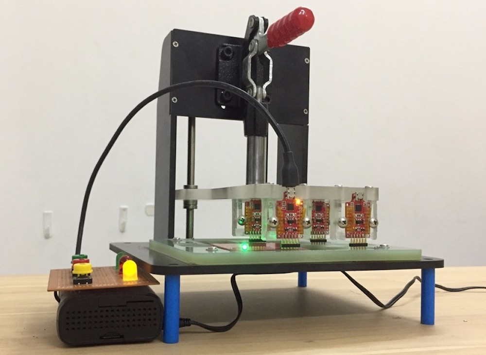
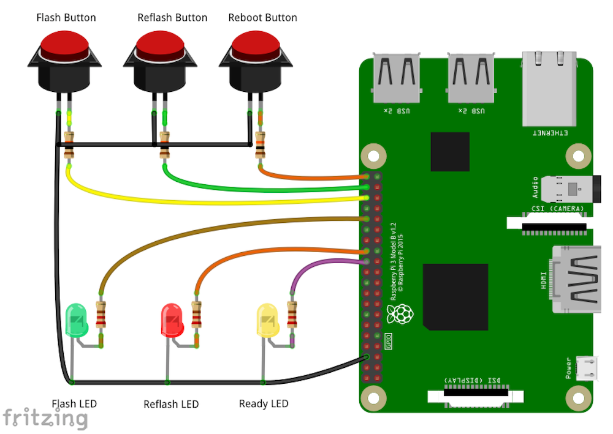
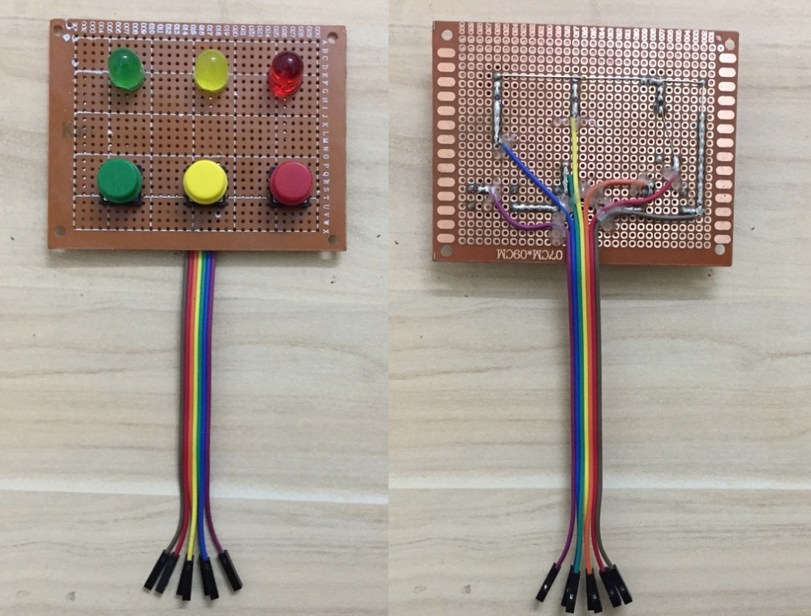

# ESP RPI FLASHER

**Mục lục**
* [Giới thiệu](#Giới-thiệu)
* [Chuẩn bị](#Chuẩn-bị)
* [Các bước thực hiện](#Các-bước-thực-hiện)
* [Lưu ý](#Lưu-ý)
* [Tài liệu tham khảo](#Tài-liệu-tham-khảo)
## Giới thiệu

Với khả năng tự động nhận biết và nạp được nhiều mạch trong cùng một thời điểm, script giúp tiết kiệm nhiều thời gian cho việc nạp code trong sản xuất.

Tính năng:
- Tự động nhận biết mạch nạp đang được kết nối.
- Nạp nhiều mạch cùng một lúc.
- Cho phép nạp lại các board nạp thất bại.




## Chuẩn bị
* [Raspberry Pi 3 Model B/B+](https://iotmaker.vn/raspberry-pi-model-b-plus.html)
* [Thẻ nhớ 16GB](https://iotmaker.vn/the-nho-microsdhc-sandisk-ultra-16gb-48mb-s.html)
* [Mạch tự động nạp cho ESP (CP2102 USB UART board)](https://iotmaker.vn/esp-auto-flash.html)
* Cáp Micro USB, nút nhấn, LED, PCB đục lỗ.

**Các nút chức năng và đèn báo**

|  | Chức năng |
|:---:|:---:|
| Flash Button | Nhấn để nạp chương trình |
| Reflash Button | Nhấn để nạp lại cho các board nạp lỗi |
| Reboot Button | Nhấn để khởi động lại Raspberry |
| Flash LED | Báo thiết bị đang nạp chương trình |
| Reflash LED | Báo có board nạp bị lỗi |
| Ready LED | Báo raspberry sãn sàng được sử dụng |

## Các bước thực hiện

* [Bước 1: Kết nối phần cứng thiết bị](#Bước-1:-Kết-nối-phần-cứng-thiết-bị)
* [Bước 2: Cài đặt hệ điều hành Raspbian cho raspberry](#Bước-2:-Cài-đặt-hệ-điều-hành-cho-Raspberry)
* [Bước 3: Cài đặt script cho raspberry](#Bước-3:-Cài-đặt-script-cho-raspberry)
* [Bước 4: Thiết lập tự động chạy script khi khởi động raspberry](#Bước-4:-Thiết-lập-tự-động-chạy-script-khi-khởi-động-raspberry)

### Bước 1: Kết nối phần cứng thiết bị

**Sơ đồ nối dây**



| | Raspberry Pin |
|:---:|:---:|
| Flash Button | 16 |
| Reflash Button | 20 |
| Reboot Button | 21 |
| Flash LED | 12 |
| Reflash LED | 7 |
| Ready LED | 8 |

Tham khảo bảng mạch điều khiển sau khi được hàn cố định




### Bước 2: Cài đặt hệ điều hành cho Raspberry
* Tải bản Raspbian mới nhất [tại đây](https://www.raspberrypi.org/downloads/raspbian/).
* Giải nén file mới tải về (file sau khi giải nén có đuôi .img).
* Cắm thẻ nhớ vào máy tính, mở terminal lên và thực hiện lệnh `sudo fdisk -l`
* Xác định tên disk khi cắm thẻ nhớ, thông thường là /dev/mmcblk0.
* Tiếp tục thực hiện các lệnh:
    * `cd Downloads/`
    * `sudo dd bs=4M if=2017-07-05-raspbian-jessie-lite.img of=/dev/mmcblk0`
* Lưu ý: Lệnh `cd Downloads/` dùng để đi đến thư mục chứa file cài đặt.
* Sau khi thực hiện xong thì chúng ta có thẻ nhớ có thể khởi động được Raspbian.

**Tham khảo:** [Cách cài đặt hệ điều hành raspbian cho raspberry.](https://www.raspberrypi.org/documentation/installation/installing-images/)

**Kết nối Wifi và SSH tới Raspberry PI**
* Rút thẻ nhớ vừa khởi tạo ra, cắm lại vào máy tính. Lúc này trên máy Linux/Ubuntu sẽ mount 2 phân vùng, phân vùng boot và phân vùng rootfs.
* Truy cập tới phân vùng rootfs, truy cập vào thư mục **/etc/wpa-supplicant/** và file **wpa-supplicant.conf** trong thư mục này, ta thực hiện:
    * Di chuyển đến thư mục **/etc/wpa-supplicant/**
    * Mở terminal tại thư mục trên và thực hiện lệnh `sudo nano wpa-supplicant.conf`
    * Sửa file với nội dung như sau:
```
ctrl_interface=DIR=/var/run/wpa_supplicant GROUP=netdev
update_config=1
network={
  ssid="your ssid"
  psk="your pass"
}
```
* Từ tháng 11/2016, Raspberry đã khóa SSH khi khởi động. Để mở khóa SSH, cần tạo 1 file ssh (lưu ý: file này không có phần đuôi mở rộng) trong phân vùng boot của SD Card.
* Cắm thẻ nhớ vào RPI và chờ khởi động trong khoảng 1 phút.
* Tìm địa chỉ IP của raspberry bằng cách đăng nhập vào trang cấu hình của Modem WiFi (ví dụ: http://192.168.1.1). Hầu hết tất cả các modem sẽ hiển thị DHCP Client list, tìm cái nào có host name là raspberrypi, lấy IP đó, ví dụ 192.168.1.12. Ngoài ra, một số phần mềm hỗ trợ scan IP như: [Angry IP Scanner](https://angryip.org/download/#mac).
* Mở terminal lên, ssh vào địa chỉ IP của raspberry: `ssh pi@192.168.1.12` và gõ mật khẩu: `raspberry` (Lưu ý máy tính cần sử dụng chung mạng với raspberry).
* Vậy là đã hoàn thành quá trình cài đặt Raspbian cho Raspberry Pi thông qua Linux/Ubuntu.

### Bước 3: Cài đặt script cho raspberry

* Mở terminal lên, ssh vào Raspberry bằng lệnh `ssh pi@192.168.1.12` và gõ mật khẩu: `raspberry`.
* Clone dự án bằng lệnh: `git clone https://git.nanochip.vn/esp/esp_rpi_flasher.git`

**Lưu ý:** Mặc định, dự án cần được lưu tại thư mục **/home/pi**, nếu muốn lưu script vào vị trí khác, tham khảo [Cấu hình đường dẫn thư mục](#Cấu-hình-đường-dẫn-thư-mục).

* Cấp quyền thực thi và chạy file cài đặt **install.sh** bằng lệnh: 
`sudo chmod +x install.sh && ./install.sh`

### Bước 4: Thiết lập tự động chạy script khi khởi động raspberry
* Sau bước cài đặt script cho raspberry, kiểm tra đường dẫn thư mục hiện tại bằng lệnh: `$PWD` (đường dẫn mặc định là /home/pi/esp_rpi_flasher)
* Gõ lệnh `sudo nano /home/pi/.bashrc` để edit file **.bashrc**
* Thêm nội dung sau vào dòng cuối của file **.bashrc**
```
echo Running at boot 
sudo /usr/bin/python3 /home/pi/esp_rpi_flasher/flasher.py &
```
Trong đó:
`/home/pi/esp_rpi_flasher/flasher.py` là đường dẫn mặc định của dự án, nếu đã lưu script vào vị trí khác, tham khảo [Cấu hình đường dẫn thư mục](#Cấu-hình-đường-dẫn-thư-mục)
* Nhấn **Ctrol** + **x** để save và reboot raspberry bằng lệnh `sudo reboot`.

Tham khảo thêm một số cách chạy script khi khởi động raspbian [tại đây](https://www.dexterindustries.com/howto/run-a-program-on-your-raspberry-pi-at-startup/)

## Lưu ý

Các thiết lập cơ bản và file code sẽ được lưu trong đường dẫn **/boot/code** theo cấu trúc như sau:

```
boot
├──code
    ├──config.ini
    ├──encrypted
        ├──app-encrypted.bin
        ├──bootloader-reflash-digest-encrypted.bin
        ├──ota_data_initial-encrypted.bin
        ├──partitions-encrypted.bin
        ├──flash_encryption_key_1.0.0.alpha.4.bin
        ├──secure-bootloader-key-256.bin
    ├──nomal
        ├──app.bin
        ├──bootloader.bin
        ├──ota_data_initial.bin
        ├──partitions.bin
```

Trong đó:
* **config.ini**: File lưu trữ các cấu hình như: chân LED, nút nhấn và đường dẫn file code,...
* **encrypted**: Thư mục chứa code đã được mã hoá (sử dụng khi nạp chương trình có secure boot and flash encryption).
* **nomal**: Thư mục chứa code chưa được mã hoá (sử dụng khi nạp chương trình thông thường).

### Secure boot and flash encryption
Mặc định script sẽ nạp chương trình theo cách thông thường (không có secure boot and flash encryption). Vào thư mục **/boot/code/** mở file **config.ini** và chỉnh sửa `isEncrypt = True` để nạp chương trình có secure boot and flash encryption.

### Cấu hình đường dẫn thư mục
Mặc định script cần được lưu theo đường dẫn **home/pi** tuy nhiên, nếu muốn lưu script trong thư mục khác cần chỉnh sửa:
* Khi hoàn thành bước 1, bước 2, bước 3, trong thư mục **/boot/code/** mở file **config.ini** và thay đổi đường dẫn của **projectPath**
* Ở bước 4: Tự động chạy script khi khởi động raspbian, cần thay đổi đường dẫn đến file **flasher.py**

### Cấu hình chân LED và Button của Raspberry
LED và nút nhấn đã được khai báo mặc định như [Bước 1: Kết nối phần cứng thiết bị](#Bước-1:-Kết-nối-phần-cứng-thiết-bị) nếu bạn muốn thay đổi chân kết nối LED và Button với raspberry, tiến hành vào thư mục **/boot/code/** mở file **config.ini** và thay đổi chân LED và Button cho phù hợp.

## Video hướng dẫn

[](https://www.youtube.com/watch?v=WYjCUG_oZSI "ESP RPI FLASHER")

## Tài liệu tham khảo

* [Raspberry Pi3 model B/B+](https://www.raspberrypi.org/products/raspberry-pi-3-model-b-plus/)
* [Install Raspbian for raspberry](https://www.raspberrypi.org/documentation/installation/installing-images/)
* [Five Ways To Run a Program On Raspberry Pi At Startup](https://www.dexterindustries.com/howto/run-a-program-on-your-raspberry-pi-at-startup/)
* [Wiring Fritzing](images/wiring.fzz)